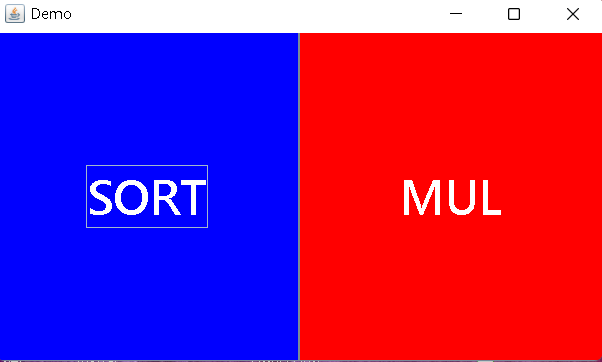
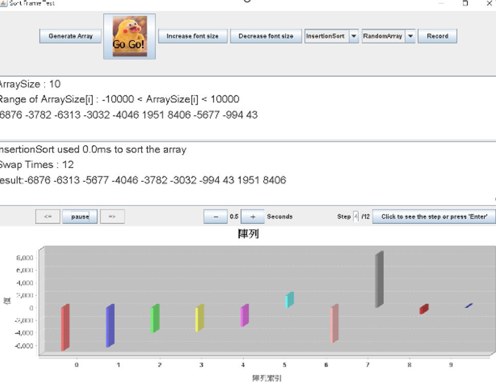
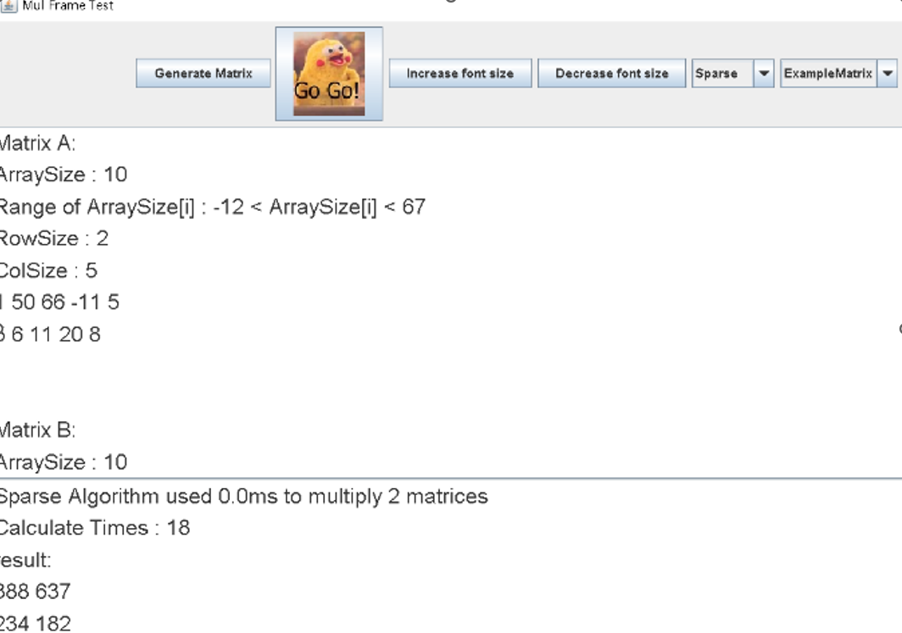
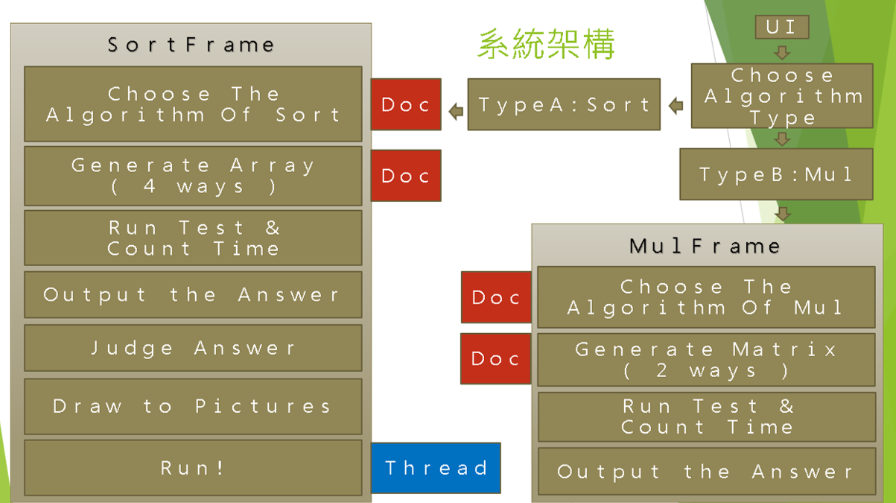

# JAVA_TSJ
A JAVA project that can perform algorithm performance evaluation.

Demo video：https://youtu.be/H_WbGOT8hPo

This system can analyze the influence of the "constant" in the time complexity of the algorithm. 
The main contents include verifying the correctness of the algorithm, calculating time-consuming, custom generation of test case, visualization of the algorithm, etc. 
The goal is teaching application and algorithm research.

# How to use?
1. Download and execute "第八組_演算法效能評比_2021.jar"
2. Choose your problem: "sort" or "matrix multiplication"
3. Choose the way you generate test data, there are 4 ways of "I/O Read", "Example", "Random", ".txt Read" to generate the data you want.
4. Don't forget to click "Generate Array/Matrix".
5. Choose the algorithm you want to use to solve the problem.
6. GoGo!

# Preview
  

# System Structure

# Research results
Since JAVA's recursive call is call by value, a divide-and-conquer algorithm such as 2D matrix multiplication like Strassen [O(n^2.807)] is actually better than Naïve [O(n^3)] is even slower (the n range is within the acceptable range for the system).
As for algorithms with the same time complexity, such as Insertion/Bubble/Selection Sort [O(n^2)], the speed under the influence of constants is Bubble << Insertion < Selection (random measurement, n>=10000)
